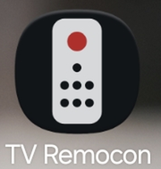
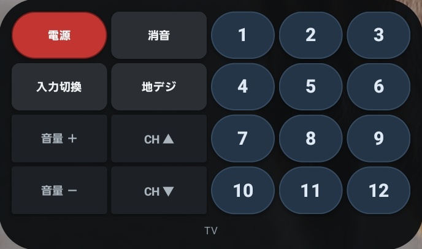
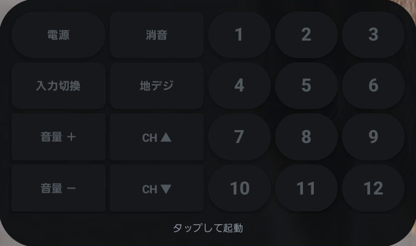
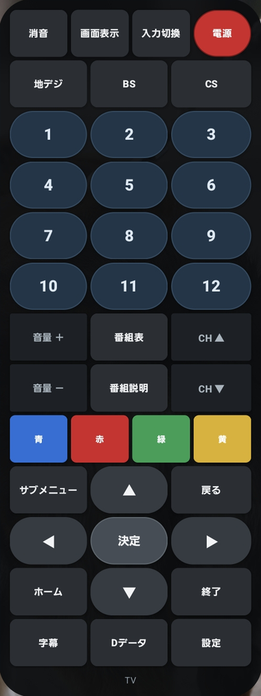
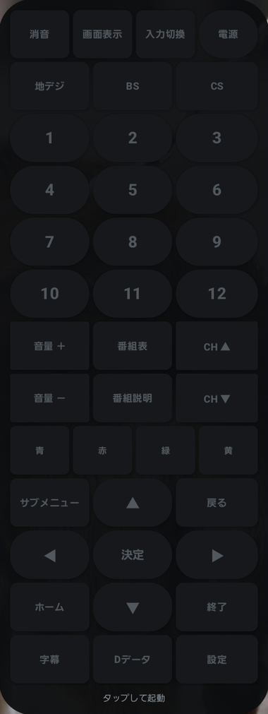

# TV Remocon

**日本語** | [English](README.en.md)

Android のホーム画面ウィジェットから、TP-Link Tapo の赤外線ハブ経由でテレビを操作する。
通信は LAN 内で完結し、クラウドを経由しない。**開発からビルドまで Termux 上の端末だけで完結している。**

<p>
  
</p>

<p>
  <br>
  <sub>横長。左に最小メニュー、右にチャンネル数字</sub>
</p>

<p>
  <br>
  <sub>普段は沈んでいて、1タップで起動する</sub>
</p>

<p>
  
  <br>
  <sub>縦に伸ばすと41キーのフルリモコン。右は休止中</sub>
</p>

## できること

ホーム画面のウィジェットを押すと、ハブから赤外線が飛ぶ。Tapo アプリを開く必要はない。

ウィジェットは**サイズによって3つの形に変わる**。アプリが自分でウィジェットをリサイズすることは
Android の仕組み上できないので（`AppWidgetManager` にあるのはランチャーからの通知だけ）、
形を選ぶのはウィジェットをリサイズする操作になる。

| 形 | 内容 |
|---|---|
| 小（横に潰す） | 電源・CH▲・CH▼ の3キー。十字キーは載せていない |
| 横長（初期） | 左に最小メニュー（電源・消音・入力・地デジ・音量・チャンネル）、右に 1-12 のチャンネルパッド |
| 大（縦に伸ばす） | 41キーのフルリモコン。カラーキー、十字キー、字幕・データ放送まで |

**普段は暗く沈んでいて、1タップで起動する。** ホーム画面のウィジェットは親指の下にあるので、
誤爆しないよう休止状態を挟んでいる。起動中は5秒間、押すたびに延長される。

ボタンは役割ごとに見た目が違う。音量とチャンネルは**四角で最も地味**（連打するキーに一番目立つ色を
置くのは逆だから）、チャンネル数字は**円形で青系**（狙って1つ押すから）、電源だけが赤。

## 動作条件

- Tapo の赤外線ハブ（H110 / 日本では **TH11** として出荷されている個体を確認）
- Tapo アプリで**サードパーティ製サービス（Third-Party Compatibility）を有効化**しておく。
  これが OFF だとハブは KLAP で応答せず、ハンドシェイクが通らない
- Tapo アプリでテレビの赤外線リモコンを登録済みであること
- Android 12 以上（`minSdk 31`。ウィジェットのサイズ別レイアウトに必要）

## インストール

**ビルド済み APK は [Releases](https://github.com/mirute02/tvremocon/releases) にある。**
Play ストアには出していない。

1. Releases から最新の `tvremocon.apk` をダウンロード
2. 開くと「提供元不明のアプリ」の許可を求められるので、ブラウザ（またはファイルアプリ）に許可を与える
3. インストール後、初回起動時に**ローカルネットワークへのアクセス**を許可する（Android 17 以降）

更新を追いたい場合は [Obtainium](https://github.com/ImranR98/Obtainium) にこのリポジトリの URL を
登録すると、Releases に新しい APK が出たときに通知が来る。

APK は専用の鍵で署名している。**同じ鍵で署名された APK しか上書きインストールできない**ので、
自分でビルドしたものと Releases のものを混在させる場合は、一度アンインストールが必要になる。
署名の SHA-256 は各リリースのノートに書いてある。
署名鍵は開発端末の外に持ち出しておらず、パスワードは端末上に保存していない。

自分でビルドする場合は [ビルド](#ビルド) を参照。

## 使い方

1. アプリを開く → **「ハブと認証情報の設定」**
2. **「ハブを探す」** で LAN を探索するか、IP を直接入力
3. TP-Link アカウントのメールとパスワードを入力して保存
4. ホーム画面を長押し → ウィジェット → **TV Remocon** を配置
5. 操作するリモコンを選ぶ（ハブと認証情報は保存済みなので、リモコンを選ぶだけ）

### パスワードをアプリに入力したくない場合

ハブにはローカル専用のパスワードという概念がなく、**クラウドアカウントから導出したハッシュ**で
認証する（`python-kasa` も同じフィールドを "of the cloud account" と説明している）。
アカウント自体は避けられないが、パスワードをアプリに渡さずに済ませることはできる。

```bash
java -cp tools/json.jar tools/KlapProbe.java hash
```

出力された64桁の16進を設定画面の authHash 欄に貼れば、メールとパスワードは空のままでよい。

> このハッシュはパスワード相当で、導出は `SHA256(SHA1(user) || SHA1(pass))` — ソルトもストレッチも
> ない。漏れればパスワードのオフライン総当たりが現実的なので、パスワードと同じ扱いをすること。

## 設計上の判断

### 赤外線は再送しない

音量が2段階上がるような**物理的な二重実行**を避けるため、アプリ層・KLAP層・HTTP層の
**それぞれで自動再送を止めている**。OkHttp は `retryOnConnectionFailure(false)`、
接続の使い回しもしない（ハブが切った接続に書き込んで即失敗する問題があった）。

結果は4種類に分けて表示する。**「応答が無い」と「テレビが動いていない」は別の事実**だから:

| 表示 | 意味 |
|---|---|
| 未送信 | 送る前に問題が分かった（Wi-Fi なし、権限なし、未設定、ハブに到達不可） |
| ハブ受付済み | ハブが `sendIrCmdById` を受理した |
| 結果不明 | 送信後に応答が途絶えた。**失敗と断定しない**。ハブは送信済みかもしれない |
| ハブが拒否 | エラーコードを明示的に返してきた |

「結果不明」を失敗と表示すると、既に送られたコマンドをもう一度押させることになる。

### エラーは入れ子の奥にある

子デバイスが失敗しても**トップレベルの `error_code` は 0 で返る**。応答全体を再帰的に走査して
`error_code` / `errorCode` を探す。さらに、**エラーが無いことは成功と同義ではない** —
実機で確認した受理応答の形と一致したときだけ「受付済み」とする。

### ラベルはプロトコル名から作る

ハブが返す `display_name` は、ダウンロード済みキーでは**4バイトに切られている**。
`POWER` は `POWE`、`NAVIGATE_UP` / `DOWN` / `LEFT` / `RIGHT` は**全部 `NAVI`** になり区別できない。
自作キー（`id == -1`）だけが完全な文字列を持つ。詳細は [docs/phase0-findings.md](docs/phase0-findings.md)。

### 直せない既知の挙動

**このテレビは1回の送信で音量が2段階動く。** ログ上、アプリは1タップにつき1リクエストしか
送っていないことを確認済みで、Tapo アプリからでも同じように2段階動く。ハブかテレビ側の
赤外線の解釈の問題で、こちらでは対処できない。

## 構成

```
transport/           暗号方式に依存しないハブ通信
  klap/              KLAP v2（鍵導出・AES-CBC・ハンドシェイク）
ir/                  H110 の赤外線 API（リモコン一覧、キー送信）
widget/              ホーム画面ウィジェットとレイアウト定義
ui/                  設定画面
net/                 Wi-Fi 固定、接続先の制限、ハブ探索
tools/KlapProbe.java ビルド不要の疎通確認ツール（Phase 0）
```

将来 TP-Link が TPAP へ移行しても影響が `transport/` に収まるよう境界を切ってある。

## ビルド

Termux 上で完結する（[docs/toolchain.md](docs/toolchain.md) に実測値）。

```bash
studio build ~/src/tvremocon                    # APK
studio gradle ~/src/tvremocon testDebugUnitTest # 単体テスト
studio run   ~/src/tvremocon --logcat           # インストールして起動
```

初回は依存のダウンロードで約2分、以降は約20秒。Jetpack Compose を使っていないのはこの時間のため。

## 貢献者向けの注意

- **`tools/fixtures/` をコミットしないこと。** 実機の `device_id` や MAC が入る。`.gitignore` 済み
- `tools/klap_vectors.json` は**架空の資格情報**から生成した固定ベクタなのでコミットしてよい
- authHash・パスワード・セッション Cookie を**ログに出さないこと**

## 関連プロジェクト

- [battery-manager](https://github.com/mirute02/battery-manager) — Tapo スマートプラグの給電を切り替えて、ノートPCのバッテリー残量を一定範囲に保つスクリプト。

## ライセンスと出典

このリポジトリのライセンスは [LICENSE](LICENSE)。
参照・翻案した外部実装とその許諾条件は [THIRD_PARTY_LICENSES.md](THIRD_PARTY_LICENSES.md) に記載。

セキュリティ上の想定と限界は [docs/security.md](docs/security.md)。

これは TP-Link の公開 API ではない。ファームウェア更新で動かなくなる可能性がある。
